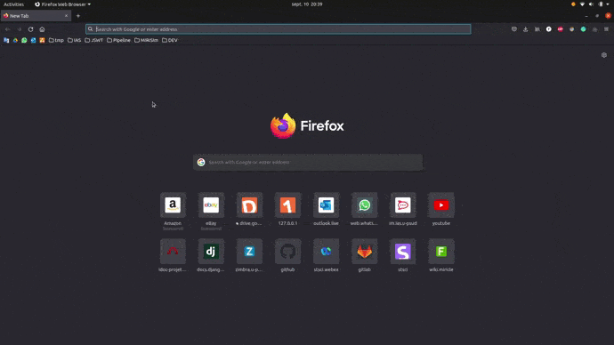

# Climbing Stars
Quick project in Python/Django

## How to launch the web app
You need Python 3 with Django 3.2 and Pillow.

* If you have conda, follow these steps in a terminal:
    ```
    conda create -n climbing_stars_env python=3.8
    conda activate climbing_stars_env
    pip install Django Pillow
    ```
* If you don't have conda, please install the latest version of Python here : https://www.python.org/downloads/

    Open a terminal and tap:
    ```
    pip install Django Pillow
    ```

Once you have this environment set, open a terminal at the root of this project and tap:
```
python manage.py runserver
```

After a second, you can open the following link in your browser : http://127.0.0.1:8000/app/


## Quick Demo

Here is a quick view of the web app.



## Launch test

To launch tests, open a terminal at the root of the project and tap:
```
python manage.py test app
```